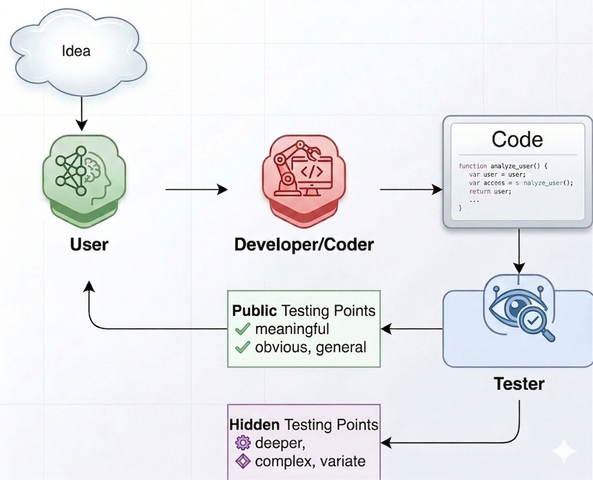

# Vibe Coding Simulation



## Overview

This project studies **multi-round vibe coding** as a controlled experiment.

Instead of asking whether a model can solve a coding task in one shot, the project asks:

> When a user and an AI coding agent interact across multiple rounds, does the code improve, stabilize, or collapse?

The experiment is designed around a three-role interaction:

1. **User simulator**
2. **Developer**
3. **Tester**

Each chain keeps the same task, the same developer, and the same simulated user knowledge level across all rounds.

## Core Experiment Design

Each chain represents one coding task under one developer configuration and one user persona.

The round loop is:

1. the user sees the original task idea;
2. the user describes the idea to the developer in their own style;
3. the developer writes code;
4. the tester evaluates the code;
5. the tester returns a **restricted public summary** to the user;
6. the tester also runs a **broader hidden test suite** for evaluation;
7. the user gives follow-up feedback to the developer;
8. the process repeats for the configured number of rounds.

This makes the setup closer to real vibe coding than a simple self-improvement prompt, while still keeping the experiment controlled and recordable.

## Roles

## 1. User simulator

The user simulator represents a human collaborator with one fixed coding knowledge level per chain.

The six levels are:

1. no coding background
2. low coding literacy
3. beginner coder
4. intermediate coder
5. advanced coder
6. expert developer

The user is not meant to behave like a benchmark oracle.
It should act like a realistic person with partial visibility:

- lower-knowledge users describe goals, symptoms, and visible failures;
- mid-level users mention examples, simple code observations, and a few tests;
- higher-knowledge users discuss constraints, edge cases, implementation concerns, and code quality.

The user behavior is controlled by the rubric files under:

- `coder-simulate-rubric/`

The level distribution is configured in:

- `coder-simulate-rubric/defaults.json`

## 2. Developer

The developer is the coding agent.

Its job is to respond to the conversation context and produce code.

Important design choice:

- the developer should **not** receive a special benchmark-style system prompt;
- the developer should **not** be forced into a `Reasoning:` / `Answer:` format;
- the developer should just act like a coding assistant responding to the conversation.

The developer supports:

- API execution;
- local Hugging Face execution;
- toy local mode for smoke tests.

## 3. Tester

The tester is a stronger evaluator than the user.

Its responsibilities are:

1. infer what the user likely cares about from the task and conversation;
2. generate a small set of **public tests** that a user could plausibly report;
3. generate a broader **hidden test suite** for private evaluation;
4. execute tests and record raw outputs;
5. return only a restricted public summary to the user.

The tester therefore has two outputs:

- **public feedback**: short, human-usable, limited;
- **hidden evaluation**: broader, stricter, and used for metrics.

This split is central to the project design.

## Main Experimental Principles

The project follows these design principles:

1. the user simulator should model a trust-and-control spectrum, not one fixed behavior;
2. the user should sound like a real collaborator, not a benchmark grader;
3. the developer should be minimally constrained;
4. the tester should be broader than the user, but not reveal everything;
5. the main correctness signal should come from hidden tests, not public feedback;
6. every interaction and artifact should be recorded for later analysis and possible training.

## Supported Run Modes

## API mode

Runner:

- `run_vibe_coding_api.py`

In this mode:

- developer uses API;
- user simulator uses API;
- tester uses API.

Developer API options support:

- OpenRouter;
- direct OpenAI-compatible endpoints.

## Local-developer mode

Runner:

- `run_vibe_coding_local.py`

In this mode:

- developer uses either:
  - a local HF model, or
  - a toy local backend;
- user simulator uses API or toy mode;
- tester uses API or toy mode.

This is the recommended mode for cheap smoke tests.

## Project Files

Main entry points:

- `run_vibe_coding_api.py`
- `run_vibe_coding_local.py`

Core logic:

- `utils/vibe_coding_chain.py`
- `utils/vibe_coding_user_sim.py`
- `utils/vibe_coding_tester.py`

Shared support used by the vibe experiment:

- `utils/multiturn_chain.py`
- `utils/openrouter.py`
- `utils/local_hf.py`
- `utils/eval_code.py`
- `utils/wandb_multiturn.py`

Knowledge-level configuration:

- `coder-simulate-rubric/README.md`
- `coder-simulate-rubric/defaults.json`
- `coder-simulate-rubric/level_1.md`
- `coder-simulate-rubric/level_2.md`
- `coder-simulate-rubric/level_3.md`
- `coder-simulate-rubric/level_4.md`
- `coder-simulate-rubric/level_5.md`
- `coder-simulate-rubric/level_6.md`

Dataset and local model preparation:

- `fetch_multiturn_benchmark_datasets.py`
- `fetch_multiturn_benchmark_datasets_full.py`
- `prepare_local_models.py`

## Metrics

The vibe-coding experiment is mainly evaluated through tester results.

Important round-level metrics include:

- `hidden_pass_rate`
- `public_pass_rate`
- `hidden_test_count`
- `public_test_count`
- `code_similarity_prev`
- `hidden_regression_count`
- `hidden_regression_accum`
- marked-out chain counts
- API failure and execution failure indicators

The most important metric is:

- **hidden pass rate**

because it captures code quality beyond what the user is explicitly told.

## Recorded Outputs

Each run writes a new directory under:

- `experiment-results/`

Typical saved outputs include:

- run config;
- dataset snapshot;
- per-round chain records;
- per-round summary metrics;
- per-condition metrics grouped by dataset, developer model, and user level;
- extracted code artifacts by round;
- user-simulator interaction logs;
- tester raw test-generation and test-result logs;
- end-of-run summary tables;
- `training_traces.jsonl` for later developer training use.

The project is designed so the run can be resumed from saved state.

## Virtual Environment

Use a project-local virtual environment at `.venv`.

From this directory:

```bash
python3 -m venv .venv
.venv/bin/pip install -r requirements.txt
```

If you want local Hugging Face developer models:

```bash
.venv/bin/pip install -r requirements_local_hf.txt
```

All commands below assume you are inside `vibe-coding-simulation/` and using `.venv/bin/python`.

## Environment Variables

Depending on the run mode, you may need:

```bash
export OPENROUTER_API_KEY=...
export OPENAI_API_KEY=...
export OPENAI_BASE_URL=...
export WANDB_API_KEY=...
```

In practice:

- OpenRouter-backed roles need `OPENROUTER_API_KEY`;
- direct OpenAI-compatible developer calls may use `OPENAI_API_KEY` and `OPENAI_BASE_URL`;
- W&B online logging needs `WANDB_API_KEY`.

## Dataset Preparation

The experiment reuses the normalized benchmark format and filters to coding tasks when building vibe chains.

Small benchmark:

```bash
.venv/bin/python fetch_multiturn_benchmark_datasets.py
```

Full benchmark:

```bash
.venv/bin/python fetch_multiturn_benchmark_datasets_full.py
```

## Local Model Preparation

If you want a real local developer model:

```bash
.venv/bin/python prepare_local_models.py --family all
```

## Usage

## Fast smoke test

```bash
.venv/bin/python run_vibe_coding_local.py \
  --datasets bigcodebench \
  --local-backend toy \
  --user-backend toy \
  --tester-backend toy \
  --max-rounds 3 \
  --max-samples-per-dataset 2 \
  --wandb-mode offline \
  --dry-run
```

## Local developer + API user/tester

```bash
OPENROUTER_API_KEY=... .venv/bin/python run_vibe_coding_local.py \
  --datasets bigcodebench,humaneval \
  --local-backend hf \
  --developer-model Qwen/Qwen2.5-Coder-7B-Instruct \
  --user-backend api \
  --tester-backend api \
  --user-model openai/gpt-4o-mini \
  --tester-model openai/gpt-4o-mini \
  --max-rounds 5 \
  --max-samples-per-dataset 5 \
  --wandb-mode offline
```

## All roles via API

```bash
OPENROUTER_API_KEY=... .venv/bin/python run_vibe_coding_api.py \
  --datasets bigcodebench,humaneval \
  --developer-model anthropic/claude-3.5-haiku \
  --developer-provider openrouter \
  --user-model openai/gpt-4o-mini \
  --tester-model openai/gpt-4o-mini \
  --workers 4 \
  --max-rounds 5 \
  --max-samples-per-dataset 5 \
  --wandb-mode offline
```

## Demo

```bash
python3 -m venv .venv
.venv/bin/pip install -r requirements.txt
.venv/bin/python fetch_multiturn_benchmark_datasets.py
.venv/bin/python run_vibe_coding_local.py \
  --datasets bigcodebench \
  --local-backend toy \
  --user-backend toy \
  --tester-backend toy \
  --max-rounds 2 \
  --max-samples-per-dataset 1 \
  --wandb-mode offline \
  --dry-run
```

This demo gives you:

1. a small coding benchmark;
2. a complete three-role vibe-coding run;
3. saved user, developer, and tester traces;
4. hidden/public pass-rate outputs for inspecting multi-round behavior.
